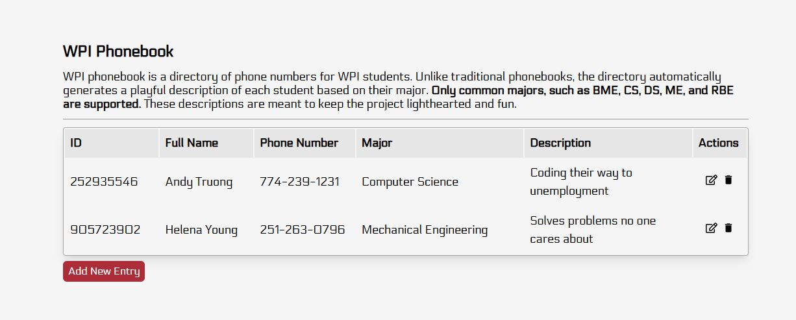

# WPI Phonebook
WPI phonebook is a directory of phone numbers for WPI students. Unlike traditional phonebooks, the directory automatically generates a playful description of each student based on their major. Only common majors, such as BME, CS, DS, ME, and RBE are supported. These descriptions are meant to keep the project lighthearted and fun.

Each user is provided a phonebook through user authentication and authorization. Users can add, read, edit, and delete records from their phonebook.  To access the application, use the following preexisting accounts (email, password):
- *Email*: gompei@wpi.edu, *Password*: mascot
- *Email*: gwang@wpi.edu, *Password*: president

https://a4-ahtruong1.vercel.app

